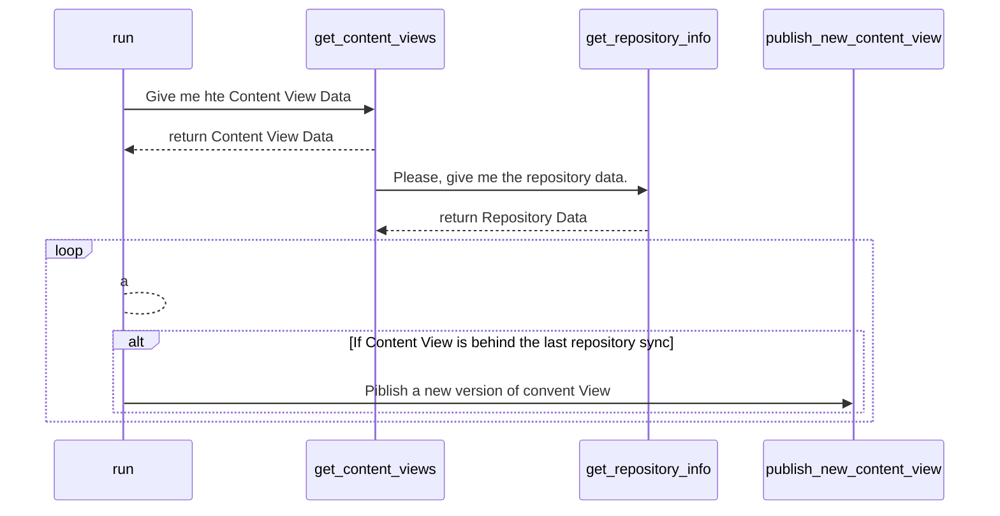

## katello-publish-content-view
This script publishes a new version of a Katello Content View if some repository was synced after last Content View version.

## Prerequisite
Python 3.6+

## Hot to use
Clone this repo and edit config.yml:
```bash
$ git clone https://github.com/brisa-dev/katello-publish-content-view.git
$ cd katello-publish-content-view
$ vi config.yml
```

Change config.yml with your custom data:
```yaml
organization_id: 1
username: some_katello_username
password: some_katello_password
api_url: https://katello.example.io
```

Run script:
```bash
$ ./run.py
```

Read run.log file to see the output.
```bash
$ cat run.log
```
If all Content View is up-to-date you will receive the message bellow:
```
--- Initializing Katello Content View Checker --- 
It's now       : 2022-06-03 10:39:27 
Content view   : zabbix 
Last Published : 2022-06-02 21:29:17 
Status         : It's not necessary to publish a new version for this Content View 
```
If a new version of a Content View was created you will receive the message bellow:
```
--- Initializing Katello Content View Checker --- 
It's now       : 2022-06-03 10:44:06 
Content view   : zabbix 
Last Published : 2022-06-02 21:29:17 
Status         : It's necessary to publish a new version for this Content View 
Action         : Creating a new version of a Content View... 
Action status  : Success! 
```

## Flow
